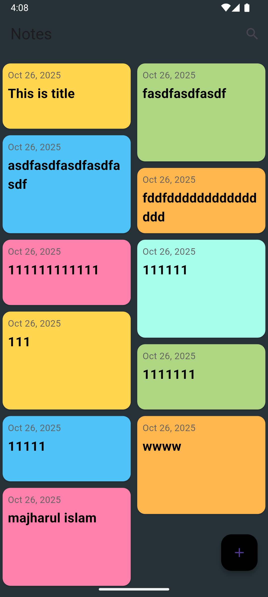
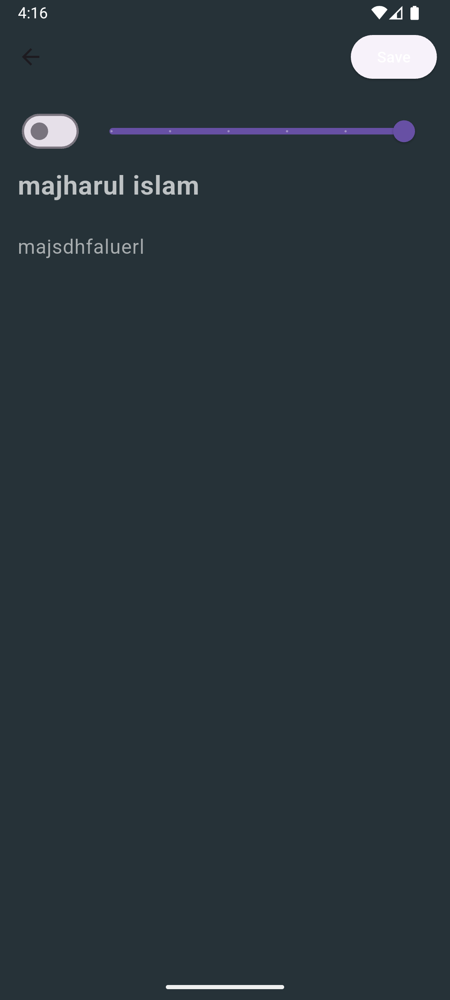
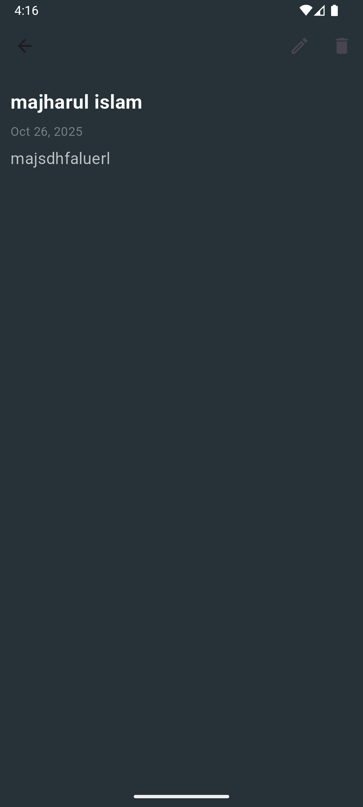

# Flutter SQLite CRUD - Notes App

A beautiful and fully functional Notes application built with Flutter and SQLite for local data persistence. This app demonstrates complete CRUD (Create, Read, Update, Delete) operations with a modern dark-themed UI.


## Table of Contents

- [Features](#features)
- [Screenshots](#screenshots)
- [Architecture](#architecture)
- [Getting Started](#getting-started)
- [Project Structure](#project-structure)
- [Database Schema](#database-schema)
- [Key Components](#key-components)
- [Dependencies](#dependencies)
- [Installation](#installation)
- [Usage](#usage)
- [Code Examples](#code-examples)
- [Contributing](#contributing)
- [License](#license)

## Features

- **Full CRUD Operations**: Create, Read, Update, and Delete notes
- **Local Database**: SQLite database for persistent data storage
- **Beautiful UI**: Modern dark theme with staggered grid layout
- **Note Properties**:
  - Title and Description
  - Importance flag
  - Number rating (0-5)
  - Creation timestamp
- **Interactive Cards**: Color-coded note cards with varying heights
- **Form Validation**: Input validation for note creation/editing
- **Responsive Design**: Portrait-only orientation with adaptive layouts


## Screenshots

| Home Screen | Add/Edit Note | Note Details |
|------------|---------------|--------------|
|  |  |  |

## Architecture

This project follows a clean architecture pattern with clear separation of concerns:

```
lib/
├── db/              # Database layer
├── model/           # Data models
├── page/            # UI screens
└── widgets/         # Reusable UI components
```

### Architecture Diagram


## Getting Started

### Prerequisites

- Flutter SDK (3.6.0 or higher)
- Dart SDK
- Android Studio / VS Code
- Android/iOS Emulator or Physical Device

### Dependencies

This project uses the following packages:

```yaml
dependencies:
  flutter:
    sdk: flutter
  cupertino_icons: ^1.0.8
  sqflite: ^2.4.1                         # SQLite database
  intl: ^0.20.2                            # Internationalization & date formatting
  flutter_staggered_grid_view: ^0.7.0     # Staggered grid layout
```

## Installation

1. **Clone the repository**
   ```bash
   git clone https://github.com/yourusername/sqflite_crud_flutter.git
   cd sqflite_crud_flutter
   ```

2. **Install dependencies**
   ```bash
   flutter pub get
   ```

3. **Run the app**
   ```bash
   flutter run
   ```

## Project Structure

```
sqflite_crud_flutter/
│
├── android/                    # Android-specific files
├── ios/                        # iOS-specific files
├── lib/
│   ├── db/
│   │   └── notes_database.dart        # Database operations & singleton
│   ├── model/
│   │   └── note.dart                  # Note model & fields
│   ├── page/
│   │   ├── notes_page.dart            # Home screen with notes grid
│   │   ├── edit_note_page.dart        # Add/Edit note screen
│   │   └── note_detail_page.dart      # Note details screen
│   ├── widgets/
│   │   ├── note_card_widget.dart      # Note card UI component
│   │   └── note_form_widget.dart      # Note form UI component
│   └── main.dart                      # App entry point
│
├── pubspec.yaml                # Project dependencies
└── README.md                   # This file
```

## Database Schema

### Table: `notes`

| Column | Type | Constraints | Description |
|--------|------|-------------|-------------|
| `_id` | INTEGER | PRIMARY KEY AUTOINCREMENT | Unique identifier |
| `isImportant` | BOOLEAN | NOT NULL | Importance flag |
| `number` | INTEGER | NOT NULL | Rating (0-5) |
| `title` | TEXT | NOT NULL | Note title |
| `description` | TEXT | NOT NULL | Note content |
| `time` | TEXT | NOT NULL | Creation timestamp (ISO 8601) |


## Key Components

### 1. Database Layer ([lib/db/notes_database.dart](lib/db/notes_database.dart))

The `NotesDatabase` class implements the Singleton pattern for database management:

**Key Methods:**
- `create(Note note)` - Insert a new note
- `readNote(int id)` - Retrieve a single note by ID
- `readAllNotes()` - Retrieve all notes ordered by time
- `update(Note note)` - Update an existing note
- `delete(int id)` - Delete a note by ID
- `close()` - Close database connection

**Database Initialization:**
```dart
static final NotesDatabase instance = NotesDatabase._init();
```

### 2. Data Model ([lib/model/note.dart](lib/model/note.dart))

The `Note` class with JSON serialization:

**Properties:**
- `id` - Unique identifier (nullable for new notes)
- `isImportant` - Boolean flag
- `number` - Integer rating (0-5)
- `title` - Note title
- `description` - Note content
- `createdTime` - DateTime timestamp

**Methods:**
- `fromJson()` - Create Note from database map
- `toJson()` - Convert Note to database map
- `copy()` - Create a copy with optional field updates

### 3. User Interface

#### Notes Page ([lib/page/notes_page.dart](lib/page/notes_page.dart))

Home screen displaying all notes in a staggered grid layout.

**Features:**
- Staggered grid view with 2 columns
- Loading indicator during data fetch
- Empty state message
- Floating action button for adding notes
- Navigation to note details on tap


#### Add/Edit Note Page ([lib/page/edit_note_page.dart](lib/page/edit_note_page.dart))

Form for creating new notes or editing existing ones.

**Features:**
- Form validation
- Importance toggle switch
- Number slider (0-5 rating)
- Title and description text fields
- Save button with validation state


#### Note Detail Page ([lib/page/note_detail_page.dart](lib/page/note_detail_page.dart))

Detailed view of a single note.

**Features:**
- Display title, description, and creation date
- Edit button (navigates to edit page)
- Delete button (removes note and returns to home)


### 4. Widgets

#### Note Card Widget ([lib/widgets/note_card_widget.dart](lib/widgets/note_card_widget.dart))

Reusable card component for displaying notes in the grid.

**Features:**
- Color rotation from predefined palette
- Variable heights for staggered effect
- Displays title and creation date
- Responsive sizing

**Color Palette:**
```dart
[
  Colors.amber.shade300,
  Colors.lightGreen.shade300,
  Colors.lightBlue.shade300,
  Colors.orange.shade300,
  Colors.pinkAccent.shade100,
  Colors.tealAccent.shade100
]
```

#### Note Form Widget ([lib/widgets/note_form_widget.dart](lib/widgets/note_form_widget.dart))

Reusable form component for note input.

**Features:**
- Importance switch
- Number slider
- Title text field (single line, bold, 24pt)
- Description text field (5 lines, 18pt)
- Input validation

## Code Examples

### Creating a Note

```dart
final note = Note(
  title: 'My First Note',
  isImportant: true,
  number: 5,
  description: 'This is a sample note',
  createdTime: DateTime.now(),
);

await NotesDatabase.instance.create(note);
```

### Reading All Notes

```dart
final notes = await NotesDatabase.instance.readAllNotes();
```

### Updating a Note

```dart
final updatedNote = note.copy(
  title: 'Updated Title',
  description: 'Updated description',
);

await NotesDatabase.instance.update(updatedNote);
```

### Deleting a Note

```dart
await NotesDatabase.instance.delete(noteId);
```

### Database Table Creation

```dart
await db.execute('''
CREATE TABLE $tableNotes(
  ${NoteFields.id} INTEGER PRIMARY KEY AUTOINCREMENT,
  ${NoteFields.isImportant} BOOLEAN NOT NULL,
  ${NoteFields.number} INTEGER NOT NULL,
  ${NoteFields.title} TEXT NOT NULL,
  ${NoteFields.description} TEXT NOT NULL,
  ${NoteFields.time} TEXT NOT NULL
)
''');
```

## Usage

### Adding a Note

1. Tap the floating action button (+) on the home screen
2. Toggle importance switch if needed
3. Adjust the rating slider (0-5)
4. Enter a title and description
5. Tap the "Save" button

### Viewing Note Details

1. Tap on any note card in the grid
2. View the full title, description, and creation date

### Editing a Note

1. Open note details
2. Tap the edit icon in the app bar
3. Modify the fields as needed
4. Tap "Save"

### Deleting a Note

1. Open note details
2. Tap the delete icon in the app bar
3. Note is immediately deleted

## Theme Configuration

The app uses a dark theme with the following configuration:

```dart
ThemeData(
  primaryColor: Colors.black,
  scaffoldBackgroundColor: Colors.blueGrey.shade900,
  appBarTheme: AppBarTheme(
    backgroundColor: Colors.transparent,
    elevation: 0,
  ),
)
```


## Database Operations Flow

```
User Action → UI Page → NotesDatabase → SQLite → Response
     ↓
   Update UI
```

1. User performs action (create, read, update, delete)
2. UI page calls corresponding NotesDatabase method
3. NotesDatabase executes SQLite query
4. Result returned to UI page
5. UI updates with new data

## Performance Considerations

- **Singleton Pattern**: Database instance is reused throughout the app
- **Async Operations**: All database operations are asynchronous
- **Lazy Loading**: Database is initialized only when first accessed
- **Resource Management**: Database connection closed when app is disposed

## Error Handling

The app includes error handling for:
- Empty form validation
- Missing note IDs
- Database initialization failures
- Navigation state management

## Future Enhancements

Potential features for future versions:

- [ ] Search functionality
- [ ] Note categories/tags
- [ ] Color picker for custom note colors
- [ ] Note sharing
- [ ] Data export/import
- [ ] Cloud synchronization
- [ ] Rich text editing
- [ ] Image attachments
- [ ] Dark/Light theme toggle
- [ ] Sorting and filtering options

## Troubleshooting

### Common Issues

**Database not initializing:**
```dart
// Ensure WidgetsFlutterBinding is initialized
WidgetsFlutterBinding.ensureInitialized();
```

**Portrait orientation not locked:**
```dart
await SystemChrome.setPreferredOrientations([
  DeviceOrientation.portraitUp,
  DeviceOrientation.portraitDown,
]);
```

## Contributing

Contributions are welcome! Please follow these steps:

1. Fork the repository
2. Create a feature branch (`git checkout -b feature/amazing-feature`)
3. Commit your changes (`git commit -m 'Add amazing feature'`)
4. Push to the branch (`git push origin feature/amazing-feature`)
5. Open a Pull Request

## License

This project is licensed under the MIT License - see the LICENSE file for details.

## Acknowledgments

- Flutter team for the amazing framework
- SQLite for reliable local storage
- Community packages: sqflite, intl, flutter_staggered_grid_view

## Contact

For questions or feedback, please open an issue on GitHub.

---

**Made with Flutter and SQLite**


